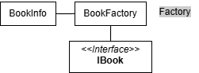
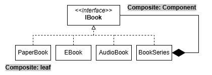
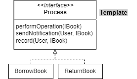
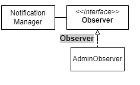
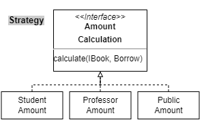
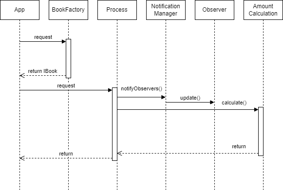
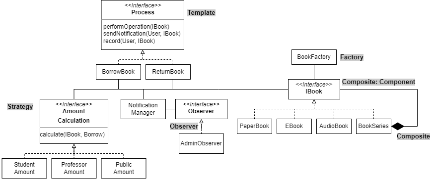
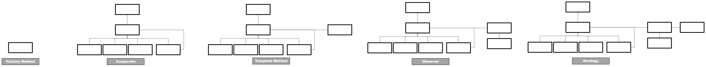

# Pattern Oriented Software Design — Term project
## Book Manager System 

Team members:

-   112598018 蕭裕憲
-   113598017 楊挺煜
-   113598030 古佳豫

## Problem Statement

近日，圖書館的管理工作日益繁瑣，如何有效管理借閱與歸還、追蹤圖書庫存，以及維護使用者資料，是許多圖書館面臨的共同挑戰。傳統的手動記錄方式不僅效率低下，還容易導致錯誤，甚至可能丟失重要資料。例如，當某本書被借出後未能及時更新庫存紀錄，可能導致其他讀者無法正常借閱。因此，我們希望設計一個圖書管理系統，利用現代化技術，提升管理效率，降低出錯率，並改善使用者體驗。

我們希望透過此系統實現多項功能，包括支援圖書的新增、修改、刪除與查詢，幫助管理者隨時掌握館藏情況；記錄使用者的借閱與歸還歷史，並在逾期時提供自動提醒通知；以及生成圖書使用與庫存情況的報表，協助管理者進行數據分析。此外，系統還將提供簡便的檢索功能，讓使用者能夠快速找到所需圖書。

## Description
本專案是一個圖書管理系統，旨在有效地管理書籍的借閱和歸還操作。系統基於 Java 設計，包含多樣的書籍類型（如紙本書、有聲書和電子書）。
為了實現上述功能，我們使用了數個設計模式，包括：
1. **Factory Pattern**：透過 BookFactory 類別實現，動態創建不同類型的書籍（如 PaperBook、AudioBook 和 EBook），並支援書籍系列（BookSeries）的生成，提升了系統的靈活性與可擴展性。
2. **Composite Pattern**:藉由設計 IBook 接口，統一抽象化單本書和書籍系列的操作邏輯，並允許遞歸地組合書籍，支持更為複雜的層次結構管理。

3. **Template Method Pattern**：實現借書和還書的固定流程，減少重複程式碼。
4. **Observer Pattern**：用於通知系統，實現借書/還書操作後的即時通知。

5. **Strategy Pattern**：用於計算逾期時的罰金。

## Future

1. **多類型書籍支持拓展：**  
   現在系統已經支持紙本書、有聲書和電子書，未來可以根據業務需求新增更多特殊書籍類型，例如限量收藏版或多媒體附加內容書籍，進一步提升系統對特殊資源的管理能力。

2. **通知機制的細化與擴展：**  
   現在的通知僅支持文字消息，未來可以加入多種通知方式（如電子郵件、即時通訊平台推送）。此外，通知內容可以更細化，例如提供具體的庫存狀態、書籍損壞報告等。

3. **費用計算邏輯的擴展：**  
   現有的費用計算邏輯依據不同使用者角色（如學生、教授）進行分級計算，未來可以加入優惠政策，例如長期借閱折扣、會員制度或積分兌換機制，提升用戶滿意度。
   
## Design Patterns Summary & Storyboard

- ### 類別圖

  

- ### 序列圖

- ### Summary

- ### Storyboard

## Design Patterns in Our Code

### Factory  Method
- **Motivation**:
  在設計圖書管理系統時，為了能夠靈活地創建多種不同類型的書籍（例如紙本書、有聲書和電子書），我們需要一個能根據輸入參數自動生成對應類型書籍的工廠模式。這樣的設計可以簡化創建物件的過程，並使代碼更具可讀性和可擴展性。

- **Solution**:
  在本專案中，BookFactory 類別實現了工廠模式。根據 BookInfo 的 material 屬性值，自動判斷應該創建哪一種類型的書籍對象。

  1. 當 material 為 **"paper"** 時，創建 **PaperBook** 對象。

  2. 當 material 為 **"audio"** 時，創建 **AudioBook** 對象。

  3. 當 material 為 **"digital"** 時，創建 **EBook** 對象。

  4. 若為未知的 material，則拋出異常。

此外，BookFactory 還支援創建書籍系列（BookSeries），實現多本書籍的分層結構。

- **Consequence**:

  - **靈活性**： 工廠模式提供了一個統一的接口來創建不同的書籍類型，擴展新書籍類型時只需新增對應的類別即可。

  - **簡化程式**： 將創建邏輯集中在工廠類別中，減少重複代碼。

  - **可維護性**： 修改創建邏輯時只需更新工廠類別，而無需遍歷整個系統的其他部分。

### Composite 
- **Motivation**:
  在圖書管理系統中，有時需要對單一本書和一組書籍進行統一處理，例如顯示書籍資訊或計算總價。單一本書和書籍系列（例如套書）應該被視為相同的對象，從而簡化處理邏輯。

- **Solution**:
  我們採用了 Composite Pattern，設計了 IBook 作為書籍的抽象接口，並將書籍系列（BookSeries）與單一本書（如 PaperBook, AudioBook, EBook）統一抽象。

  - IBook 提供通用方法，如 getName()、display()，以及針對書籍系列的 add() 和 remove() 默認實作。

  -  單一本書實現 IBook，提供具體的書籍資訊。

  - 書籍系列 BookSeries 作為 Composite 類別，可以包含其他 IBook 實例，無論是單本書還是嵌套的書籍系列。

- **Consequence**:
  - **簡化邏輯**： 使用者可以用相同的方式處理單一本書和書籍系列。

  - **易於擴展**： 可以輕鬆新增其他類型的書籍類別，而無需改變 Composite 的邏輯。

  - **層次結構清晰**： 書籍系列可以包含子系列，形成遞歸結構，支持複雜的書籍管理需求。

### Template Method

- **Motivation:**  
在設計一個圖書管理系統時，針對不同操作（如借書與還書），儘管每個操作的行為可能不同，這些操作的邏輯流程（例如檢查操作是否可行、通知相關人員以及記錄操作）卻是固定的。為了避免重複撰寫這些邏輯，並提升程式碼的可讀性與可維護性，我們選擇使用 Template Method Pattern。

- **Solution:**  
Template Method Pattern 定義了一個標準化的執行流程，具體的步驟由抽象方法實作。  
在本專案中，`Process` 類別提供了一個固定的模板方法 `process()`，包含以下三個抽象步驟：  
  1. **檢查操作是否可行** (`performOperation`)  
  2. **發送通知** (`sendNotification`)  
  3. **記錄操作** (`record`)  

具體的實作，例如 `BorrowBook` 和 `ReturnBook`，分別繼承 `Process`，並實作這些抽象方法以處理各自的邏輯。

- **Consequence:**  
  - **程式更加簡潔：** 重複的程式碼被抽取到基底類別中，減少程式碼的冗餘。  
  - **易於擴展：** 新增操作時，只需實作特定的抽象方法即可。  
  - **高可維護性：** 共通邏輯集中管理，降低錯誤修改的風險。  

### Observer

- **Motivation:**  
為了實現系統中通知機制（如借書或還書後即時通知）且降低不同模組間的相依性，我們需要一個解決方案，使得一個物件能主動通知多個對其感興趣的物件，並且不需直接關聯。

- **Solution:**  
我們採用了 Observer Pattern。`NotificationManager` 作為 Subject，提供 `subscribe` 和 `unsubscribe` 方法來管理觀察者，並透過 `notifyObservers` 方法負責廣播通知。  
`Observer` 是一個接口，所有觀察者（如 `AdminObserver`）需實作其 `update` 方法以處理通知。

- **Consequence:**  
  - **可擴展性：** 新增觀察者時，只需實作 Observer 接口並註冊到 Subject 即可。  
  - **提升測試性：** 觀察者的邏輯可以被單獨測試，增加系統的穩定性。  

### Strategy 
- **Motivation:**
在考慮到逾期還書應會有相對應的懲罰（如罰金，禁止借閱等等），我們應該在還書流程中增加計算罰金的部分（我們以罰金作為逾期懲罰）。

- **Solution:**
懲罰可能因借閱人的身份、書籍的種類有所不一，所以使用了Strategy Pattern，因應不同的情況選擇罰金的計算方式。提供`calculate(IBook, Borrow)`計算罰金。

- **Consequence:**
  - **可修改性：** 因為統一使用`AmountCalculation`的介面，如果計算的方式有修改，不必更改`RetunrBook`的內容，修改實作的類別即可。
  - **高測試性：** 計算的邏輯可以單獨測試，確保系統正確性。